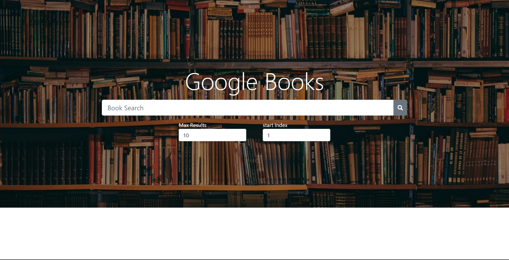
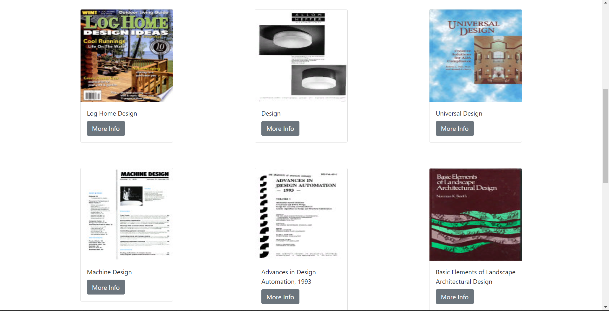
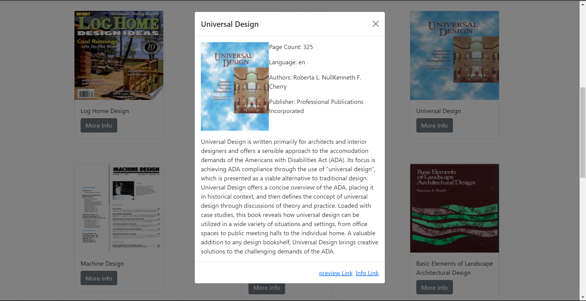

# **Google-Books**

Один из моих сольных проектов.
Данный проект показался мне довольно интересным и мне захотелось его реализовать.

[Демо-приложения](https://google-books-app-by.herokuapp.com/)

## **Функционал приложения.**

- Поиск книг  
- Просмотр краткой информации об той или иной книге. 
- Модальное окно которое появляется при клике на кнопку "More Info".  
- Возможность перехода на выбранную книгу в библиотеке Google.   
- Возможность менять количество отображения книг, то есть выбор количества отображаемого контента. 

## **Запуск проекта.**

Для запуска проекта вам необходимо набрать команду в терминале:  

- npm start

### **Технологии проекта**

